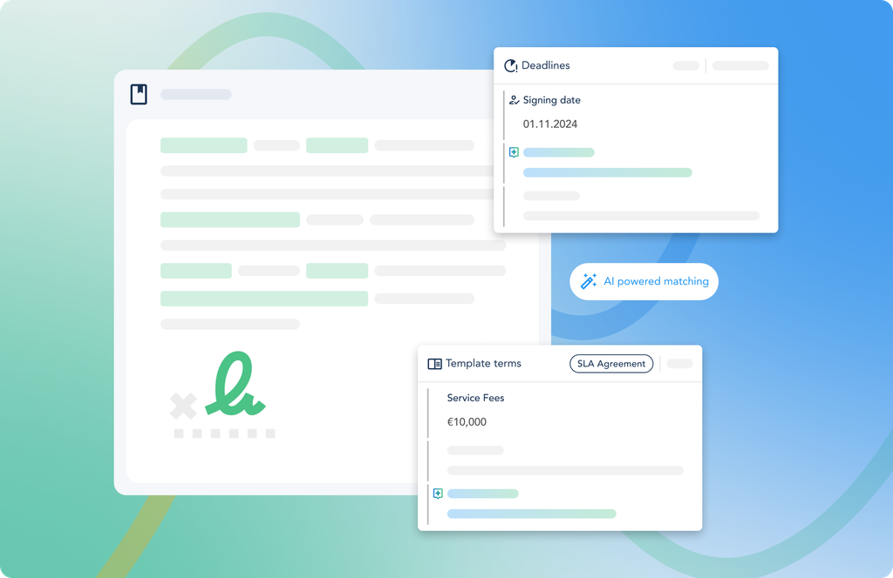

# ⚖️ Empowering Legal Teams to Review Contracts 150% Faster

> 🚧 **This project is currently under active development. Expect changes.**

A contract intelligence platform powered by Machine Learning and served through a FastAPI backend. The system aims to help legal teams drastically reduce contract review time by surfacing key clauses, obligations, and deadlines with AI.

---

## 🧭 Project Goal

Accelerate legal contract reviews by:

* Structuring critical data (terms, dates, obligations) from unstructured documents
* Simplifying review workflows through intelligent UI + AI
* Enabling traceability, compliance, and collaboration for legal teams

---

## 👨‍💻 My Role

As the **Machine Learning and Backend Engineer**, I am responsible for:

* ✅ Designing and training models for clause classification, summarization, and risk detection
* ✅ Developing and maintaining the FastAPI backend for document ingestion, ML inference, and feedback collection
* 🛠 Currently working on:

  * Fine-tuning legal-specific transformer models
  * Building APIs to support real-time frontend interaction
  * Structuring a modular, scalable ML service architecture

## 🎥 Demo
<video src="./src/assets/Demo.mp4" width="100%" autoplay loop muted playsinline controls>
  Your browser does not support the video tag.
</video>

  

---

## 👤 Author

**Mahmoud Namnam**
ML & Backend Developer
📫 [mahmoud.namnam72@gmail.com](mailto:mahmoud.namnam72@gmail.com)

---

## ❗Disclaimer

This system is **under active development** and not yet ready for production use. Models and endpoints are subject to change, and API stability is not guaranteed at this stage.

